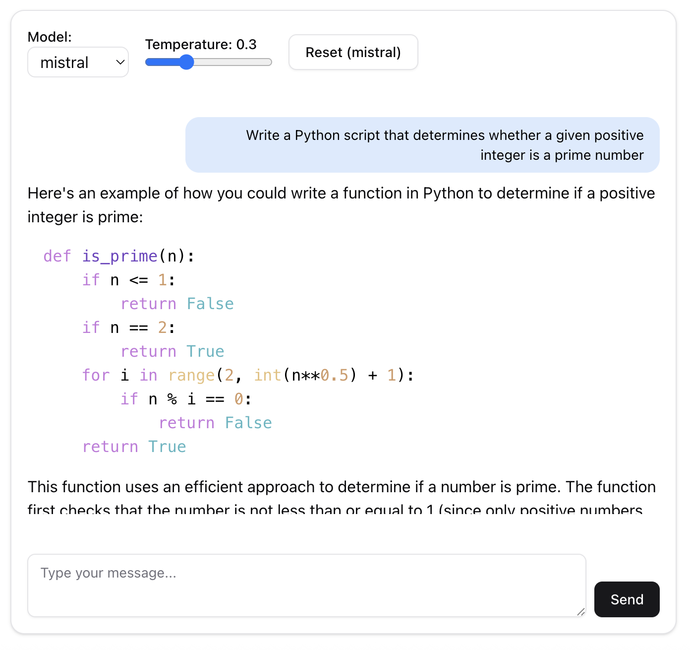

# Local chat using Ollama + Langchain

A local AI chat application using Ollama for LLM inference, LangChain for conversational memory, FastAPI as backend, and React + Tailwind + ShadCN UI as the frontend.

---

## Chat Interface

Here’s a preview of the local chat interface:



---

# Requirements & Installation

**Local chat** is a local AI chat application featuring:  
- **Backend**: FastAPI + LangChain + Ollama (local LLM)  
- **Frontend**: React + TailwindCSS + ShadCN UI  

---

## System Requirements

**Mandatory**  
- **Python** ≥ 3.10 (3.11/3.12 recommended)  
- **Node.js** ≥ 18 and **npm**  
- **Ollama** installed and running in the background  

**Optional (Recommended)**  
- **Git**  
- Basic build tools (required for some Python packages):  
  - macOS: Xcode Command Line Tools (`xcode-select --install`)  
  - Ubuntu/Debian: `build-essential`  
  - Windows: Visual Studio Build Tools (C++ workload)  

---

## Quick Installation by OS

### macOS (Intel & Apple Silicon)

```bash
# Install Node.js 18+
brew install node

# Install Python 3.12 (optional if already 3.10+)
brew install python@3.12
echo 'export PATH="$(brew --prefix python@3.12)/bin:$PATH"' >> ~/.zshrc && source ~/.zshrc

# Install Ollama
brew install ollama
brew services start ollama   # or: ollama serve &
```

Download at least one model:  
```bash
ollama pull mistral
# optional:
ollama pull tinyllama
```

---

### Ubuntu/Debian

```bash
# Node.js 18 LTS
curl -fsSL https://deb.nodesource.com/setup_18.x | sudo -E bash -
sudo apt-get update && sudo apt-get install -y nodejs

# Python 3.10+ + venv + build tools
sudo apt-get install -y python3 python3-venv python3-pip build-essential

# Ollama
curl -fsSL https://ollama.com/install.sh | sh
sudo systemctl enable ollama && sudo systemctl start ollama
ollama pull mistral
```

---

### Windows 10/11

1. Install:
   - **Python 3.10+** → [python.org/downloads](https://www.python.org/downloads/) (check *Add Python to PATH*)  
   - **Node.js 18 LTS** → [nodejs.org](https://nodejs.org/)  
   - **Git** → [git-scm.com](https://git-scm.com/)  
   - **Ollama** → [ollama.com](https://ollama.com/)  

2. Verify Ollama and download models:
   ```powershell
   ollama run mistral   # downloads automatically if missing
   # or:
   ollama pull mistral
   ```

> On Windows, activate the venv with:  
> `venv\Scripts\activate`  

---

## Environment Variables (recommended)

### Backend (`backend/.env`)
```env
# Ollama daemon (default local)
OLLAMA_BASE_URL=http://127.0.0.1:11434

# Default model (must exist in Ollama: `ollama list`)
MODEL_DEFAULT=mistral

# CORS (frontend URL)
CORS_ALLOW_ORIGINS=http://localhost:3000
```

### Frontend (`frontend/.env.local`)
```env
# FastAPI backend URL
NEXT_PUBLIC_API_BASE=http://localhost:8000
```

> If omitted, defaults will work for local development.  

---

## Getting Started

### 1) Backend (FastAPI + LangChain)
```bash
cd backend
python -m venv venv
# macOS/Linux
source venv/bin/activate
# Windows PowerShell:
# .\venv\Scripts\Activate.ps1

pip install --upgrade pip
pip install -r requirements.txt

# Ensure Ollama has a model available
ollama list
# if missing:
# ollama pull mistral

# Start FastAPI backend (dev mode)
uvicorn main:app --reload
# Backend available at: http://localhost:8000
```

> **Tip**: Expose over LAN with:  
> `uvicorn main:app --host 0.0.0.0 --port 8000`

---

### 2) Frontend (React + Tailwind + ShadCN UI)
Open a new terminal:  
```bash
cd frontend
npm install
npm run dev
# Frontend available at: http://localhost:3000
```

Make sure the backend is running on port `8000`.

---

## Quick Verification

- **Ollama** → `curl http://localhost:11434/api/tags` should list models  
- **Backend** → visit `http://localhost:8000/docs` (Swagger UI)  
- **Frontend** → visit `http://localhost:3000` to access the chat  

---

## Optional Setup Script (macOS/Linux)

Create `scripts/setup_mac_linux.sh`:
```bash
#!/usr/bin/env bash
set -euo pipefail

# Ensure Ollama is available
if ! command -v ollama >/dev/null 2>&1; then
  echo "Please install Ollama first: https://ollama.com"
  exit 1
fi

# Start Ollama
(ollama serve >/dev/null 2>&1 &) || true
sleep 2
ollama pull mistral || true
ollama pull tinyllama || true

# Backend
cd "$(dirname "$0")/../backend"
python -m venv venv
source venv/bin/activate
pip install --upgrade pip
pip install -r requirements.txt

# Frontend
cd ../frontend
npm install

echo "✅ Setup complete."
echo "Start with:"
echo "1) Backend:  cd backend && source venv/bin/activate && uvicorn main:app --reload"
echo "2) Frontend: cd frontend && npm run dev"
```
```bash
chmod +x scripts/setup_mac_linux.sh
```

---

## Key Features

- Conversational memory (buffered or vector-based)  
- Real-time streaming (ChatGPT-style typing)  
- Clean UI with React + Tailwind + ShadCN  
- Model selector (Mistral, TinyLLaMA, etc.)  
- Adjustable temperature & response length  
- Reset conversation per model  
- Clear separation between **frontend** and **backend**  

---

## Troubleshooting

- **`Failed to connect to Ollama`**  
  - Ensure `ollama serve` is running  
  - Verify `OLLAMA_BASE_URL` (default `http://127.0.0.1:11434`)  
  - Check port usage: `lsof -i :11434`  

- **CORS issues**  
  - Ensure `CORS_ALLOW_ORIGINS` includes `http://localhost:3000`  

- **`uvicorn` not found / not starting**  
  - Activate the correct venv  
  - Re-run `pip install -r requirements.txt`  
  - Ensure `main.py` exports `app`  

- **Outdated Node/npm**  
  - Update to Node.js ≥ 18  
  - Verify with `node -v` and `npm -v`  

---

## Author

- [William De la Cruz](https://github.com/williamdelacruz) — Project Creator & Main Developer  
- Contributions are welcome! Feel free to open an issue or submit a pull request.
